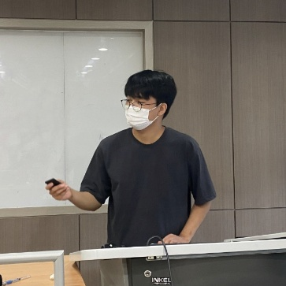
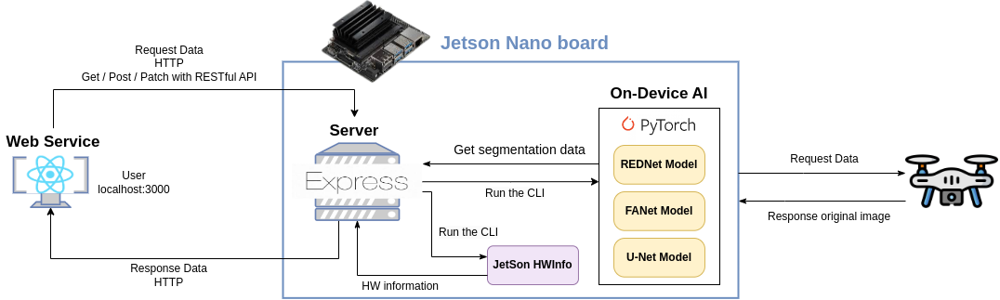
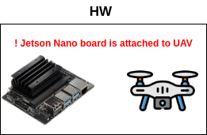

# 2023 CNU SW/AI Project Fair

## 🏛️ 프로젝트 제목
- UAV 온디바이스 재난영역 검출 소프트웨어

## 👥 팀 Ham-G-Gong
- 햄뿡이 지구뿌셔 공모전뿌셔

## 🧑‍💻 구성원

|  |  |  |
|:--------------------------------------------------------------------------------------------------------------------------------------:|:---------------------------------------------------------------------------------------------------------------------------------------:|:------------------------------------------------------------------------------------------------------------------------------------:|
|[하상호](https://github.com/sangho0804)|[김기환](https://github.com/gihwan-kim)|[임건우](https://github.com/rjsdn0124)|
|CNU|CNU|CNU|
|CSE|CSE|CSE|

## 🔍 프로젝트 추진 배경
- 자연재해의 위험성

  자연재해는 인간의 안전을 위협하고 여러 기반 시설과 시스템을 마비시킨다. 이러한 자연재해에 대한 정확한 파악은 재난을 대비하고 대응하는 데 중요하다.
- UAV를 이용한 재난 사항 분석 방식의 문제점

  최근 UAV를 이용하여 재난 상황을 파악하기 위해 사람이 접근하기 어려운 재난지역의 영상을 수집하고 분석하는 데 사용하고 있다. 이러한 데이터를 중앙으로 집중시켜 분석하는 방식은 높은 성능의 컴퓨팅, 통신장비가 필요하며 이는 과도한 시스템 운용 비용을 일으킨다.
- 온디바이스 AI를 이용한 데이터 분석 방식

  데이터가 생성되는 UAV 단계에서 데이터 분석을 수행하여 불필요한 컴퓨팅, 통신장비를 없애 시스템 운용 비용을 크게 감소시킬 수 있다. 하지만 UAV는 제한된 전력 문제로 인해 낮은 성능의 컴퓨팅 파워를 가져 UAV 단계에서의 분석을 수행하는 기능이 제한된다.

※ 따라서 UAV 기반 edge 장치에서 재난영역에 대한 효율적이고 효과적인 재난영역을 검출하는 software 개발이 필요하다.

## 🤖 시스템 구조

## 🛠️ 하드웨어 구조

- Jetson Nano Board 를 드론에 부착하여 사용합니다.

## 프로젝트 구성요소

1. [On-device AI model: U-Net, Attention U-Net](https://github.com/Ham-G-Gong/GradProj_UNet_series)
    > 영역 검출을 수행하는 AI 모델
2. [On-device AI model: REDNet, FANet](https://github.com/Ham-G-Gong/GradProj_REDNet_FANet)
    > 영역 검출을 수행하는 AI 모델
3. [Front-End](https://github.com/Ham-G-Gong/GradProj)
    > AI 모델의 영역 검출결과와 하드웨어 상태 정보를 시각화
4. [Server](https://github.com/Ham-G-Gong/GradProj_Server)
    > Front 의 요청에 따라 CLI 명령어를 이용해 Front 에 데이터 전달